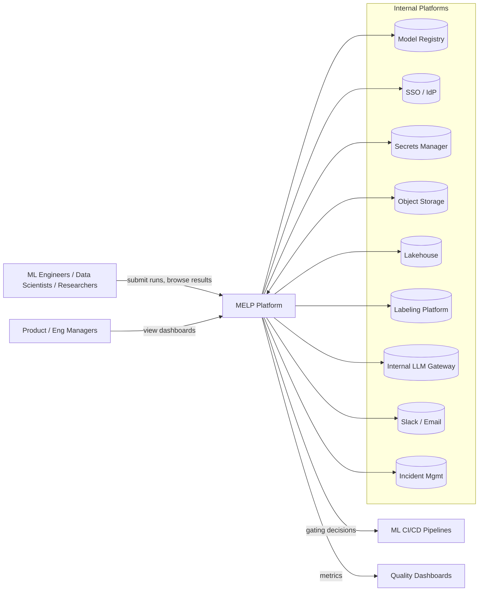
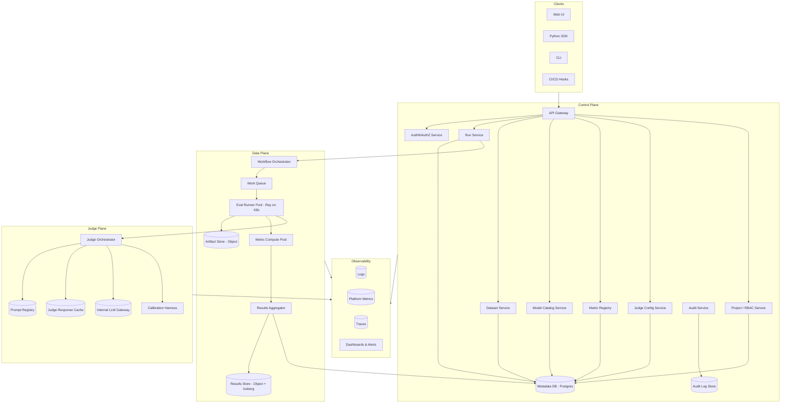
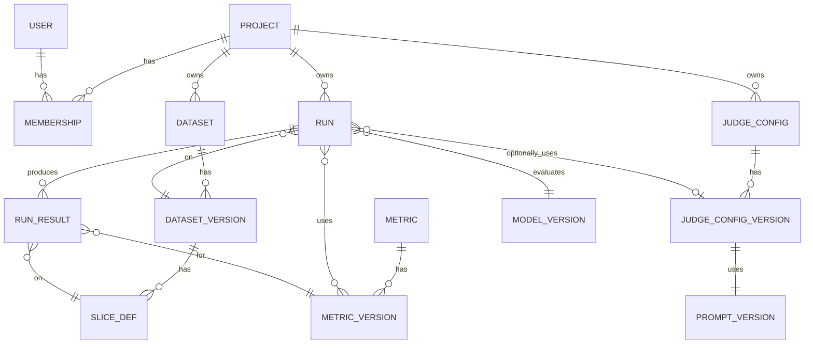
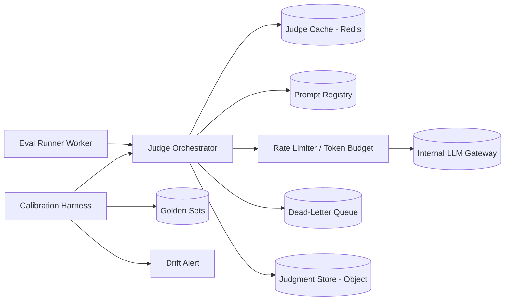
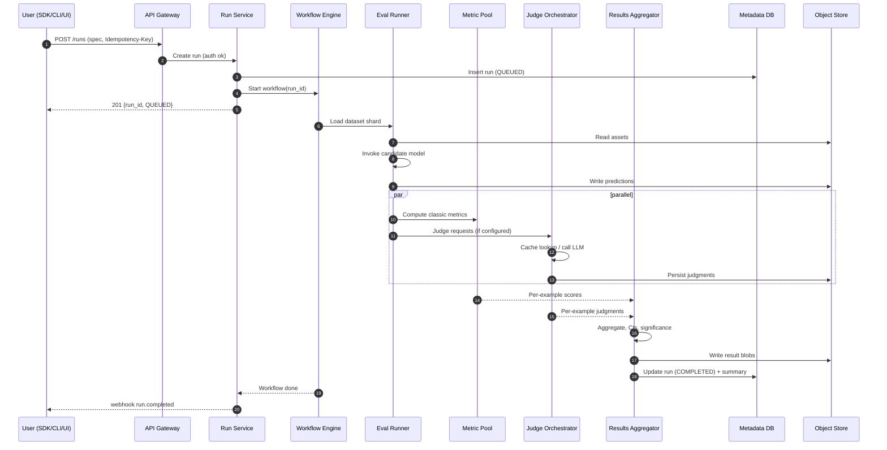
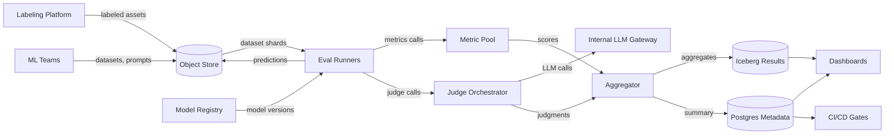
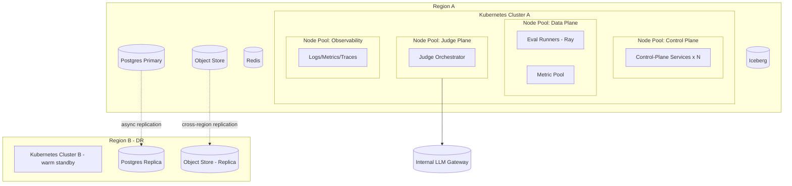
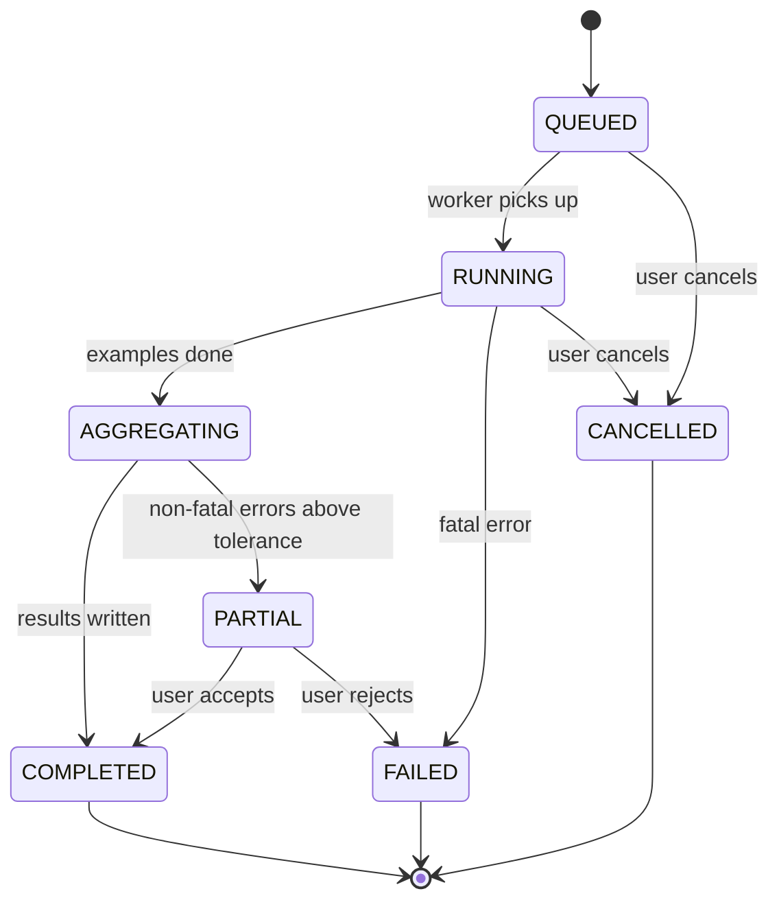
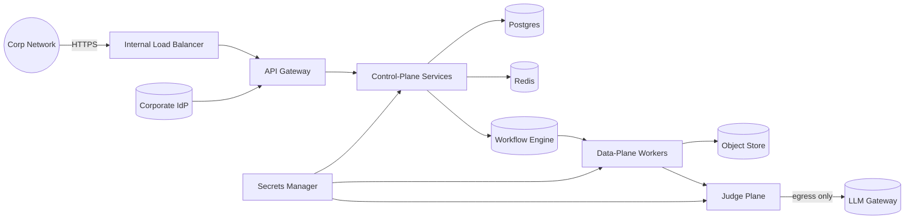

# Multimodal Evaluation & Learning Platform (MELP)
## System Design and Architecture Document

**Document version:** 1.0 (Draft)
**Owning team:** Video Engineering — Data Analytics & Quality
**Author:** ML Data Scientist Lead
**Status:** For review
**Last updated:** May 16, 2026

---

## 1. Executive Summary

### 1.1 Purpose

The Multimodal Evaluation & Learning Platform (MELP) is an internal platform for the Video Engineering Data Analytics & Quality (VEDAQ) organization to design, run, and govern evaluations of machine learning models — including supervised, unsupervised, deep learning, foundation, and multimodal systems — that ship in the organization's hardware and services. MELP treats *evaluation* as a first-class engineering artifact: reproducible, versioned, auditable, and continuously executed against production-candidate models.

Today, model evaluation across VEDAQ is fragmented. Different teams maintain their own notebooks, scoring scripts, judge prompts, and ad-hoc dataset folders. The cost is real: regressions reach later integration stages, results disagree across teams, and we cannot answer basic questions such as *"How did Model B perform versus Model A on the same slice, with the same metric definition, on the same date?"* MELP exists to remove that ambiguity.

### 1.2 Business Goals

1. **Faster, safer launches.** Cut model evaluation turnaround from days to hours so feature teams can iterate inside one development sprint.
2. **Cross-team comparability.** A single source of truth for metric definitions, datasets, slices, and leaderboards. Two teams running "the same eval" must get the same number.
3. **Foundation- and multimodal-model readiness.** First-class support for evaluating LLMs, vision-language models, and video+audio models — including LLM-as-Judge workflows for open-ended outputs such as summarization, reasoning, and generation.
4. **Quality gates in CI/CD.** Plug evaluation results into model-release decisions, with statistical rigor (confidence intervals, significance tests) rather than point estimates.
5. **Governance and auditability.** Every score traceable to a model version, dataset version, metric version, prompt version, and judge configuration.

### 1.3 Major Design Choices

| Decision | Choice | Why |
|---|---|---|
| Topology | Control plane / data plane split | Lets metadata service stay highly available while compute scales independently |
| Compute substrate | Kubernetes + Ray for distributed eval workers | Industry standard, plays well with existing internal infra |
| Storage | Object store for artifacts, Postgres for metadata, columnar lake (Iceberg) for metric history | Right tool per data shape; supports time-travel queries on metrics |
| Async orchestration | Temporal-style workflow engine | Eval pipelines are long-running, multi-stage, and need durable retries |
| LLM-as-Judge | First-class subsystem with provider abstraction, prompt registry, calibration harness | Judge quality drift is the single biggest risk for subjective eval |
| Metric system | Plugin-based metric registry, every metric is code + version + tests | Prevents the "everyone computes BLEU slightly differently" problem |
| Datasets | Content-addressed, immutable, versioned with lineage | Reproducibility is non-negotiable |
| Multi-tenancy | Logical projects with quota and RBAC | One platform, many ML teams |

### 1.4 Key Tradeoffs

- **Generality vs. opinionatedness.** MELP is opinionated about *how* evaluations are structured (run = model × dataset × metric × slice × seed) and accepts the cost of teams rewriting some legacy scripts to fit the model. Without this, comparability collapses.
- **Latency vs. statistical rigor.** Default runs compute bootstrap confidence intervals and paired significance tests. This costs ~2–4× the compute of a point estimate but is what gives results decision-grade weight. Users can opt out for exploratory runs.
- **Build vs. buy for judges.** We do not train our own judge models; we wrap and calibrate external and internal foundation models. This lets us focus engineering effort on *calibration, prompt versioning, and bias measurement* rather than judge training.
- **Strong consistency on metadata, eventual consistency on metric aggregates.** Run metadata writes are transactional; rolled-up leaderboards are computed asynchronously. Acceptable because leaderboards are advisory, not gating.
- **Centralized infrastructure, federated dataset ownership.** Teams own their datasets and judge prompts; MELP owns runtime, storage, metric registry, and governance.

---

## 2. Scope and Requirements

### 2.1 Functional Requirements

**FR-1. Evaluation run lifecycle.** Users can define, submit, monitor, cancel, and retrieve results of evaluation runs. A run is the tuple `(model_version, dataset_version, metric_set, slice_set, judge_config?, seed)`.

**FR-2. Model registry integration.** MELP reads model versions from the existing model registry; users specify a model by URI rather than uploading weights.

**FR-3. Dataset management.** Users create, version, slice, and share evaluation datasets. Datasets are immutable once published; new versions get new IDs. Slice definitions are stored as code, not free-text.

**FR-4. Metric registry.** A catalog of metric implementations (precision/recall/F1, BLEU, ROUGE, FID, CLIPScore, perplexity, custom). Each metric is a versioned plugin with unit tests, a typed signature, and documentation.

**FR-5. LLM-as-Judge.** Users define a judge configuration (model, prompt template version, scoring rubric, calibration set). MELP runs the judge, records per-example judgments, and surfaces aggregate scores with inter-rater agreement against human reference where available.

**FR-6. Multimodal evaluation.** Support image+text, video+audio, video+text, and audio+text inputs and outputs. The platform does not assume a single tensor shape per example.

**FR-7. Statistical rigor.** Every aggregate score reports a point estimate, a bootstrap confidence interval, sample size, and (where applicable) a paired significance test against a chosen baseline.

**FR-8. Slicing and failure analysis.** Compute metrics per slice (e.g., low-light video, accented speech, long-context prompts). Surface worst slices automatically; export failing examples for human review.

**FR-9. Dashboards and leaderboards.** Web UI for comparing runs, browsing model histories, and exploring slices. Shareable links with stable IDs.

**FR-10. APIs and SDK.** Python SDK for programmatic use; REST/gRPC APIs for service-to-service integration; CLI for terminal workflows.

**FR-11. Notifications and CI hooks.** Webhooks and PR comments for completed runs; gating decisions exposed via API.

**FR-12. Reproducibility.** Any run can be re-executed from its ID alone, producing identical results modulo intentionally stochastic components, with seed control.

**FR-13. Access control.** Project-scoped RBAC; sensitive datasets restricted to authorized members.

**FR-14. Audit log.** Every mutating action recorded with actor, timestamp, before/after state.

### 2.2 Non-Functional Requirements

| Category | Requirement |
|---|---|
| Availability | 99.9% for control plane API and UI |
| Run throughput | 10,000 evaluation runs/day platform-wide; 1M example-evaluations/day per project (P99) |
| Latency | Run submission ack < 500 ms (P99). Small run (≤1k examples, classic metrics) end-to-end < 5 min. Judge-based run, 10k examples: < 60 min |
| Durability | 11 nines for dataset and result storage; no silent data loss |
| Reproducibility | Bit-for-bit identical results for non-stochastic metrics; tolerance band documented for stochastic ones |
| Security | All data encrypted in transit and at rest; SSO via the corporate IdP |
| Compliance | Comply with internal data handling standards; no customer PII flows through MELP |
| Observability | Every run emits structured logs, metrics, and traces; mean time to detect (MTTD) failures < 5 min |

### 2.3 Assumptions

- The internal Kubernetes platform, object storage, IdP, secrets manager, and model registry are available and operated by other teams.
- Judge LLMs are reachable via stable internal API gateways with rate limits the platform team can negotiate.
- Datasets in scope are at most low tens of TB per project; we are not building a generic data lake.
- Teams will commit to using versioned metric implementations from the registry rather than ad-hoc one-offs in production gating decisions.

### 2.4 Constraints

- Must operate within the organization's existing internal cloud footprint; no third-party SaaS in the primary data path.
- Customer data does not enter MELP. Only test/eval datasets, model outputs on those datasets, and synthetic data.
- Engineering headcount in year one: one lead, four engineers, one data scientist. Scope must fit this.

### 2.5 Out of Scope

- **Training infrastructure.** MELP evaluates models; it does not train them.
- **Model serving.** Production inference is owned by the serving platform team. MELP only invokes models for evaluation.
- **Annotation tooling.** Human annotation is handled by an existing internal labeling platform. MELP consumes its outputs.
- **A/B testing in production.** Online experimentation belongs to the experimentation platform.
- **General-purpose business intelligence.** MELP dashboards are for model quality, not revenue or telemetry analysis.

---

## 3. Stakeholders and Users

### 3.1 Primary Users

| Persona | Needs | Typical interactions |
|---|---|---|
| **ML engineer** | Run evals on candidate models; debug regressions | SDK, CLI, dashboards |
| **Data scientist** | Define metrics, slices, judges; analyze results | SDK, notebooks, dashboards, dataset tools |
| **Research scientist** | Benchmark new architectures against shared baselines | SDK, leaderboards |
| **Engineering manager** | Track quality trends across releases | Dashboards, scheduled reports |
| **Product manager** | Understand model readiness for launch | Dashboards, executive summaries |

### 3.2 Internal Teams

- **VEDAQ (owning team).** Operates MELP, owns roadmap, on-call.
- **ML feature teams** (e.g., on-device vision, video understanding, speech). Primary consumers.
- **Foundation model teams.** Heavy users of judge-based and multimodal evaluation.
- **ML infrastructure.** Operates Kubernetes, model registry, model serving — upstream dependencies.
- **Data platform.** Operates object storage, lakehouse, lineage tooling.
- **Security & privacy review.** Approves data classifications and access policies.

### 3.3 External Systems

External to MELP, internal to the organization. No third-party systems in the data path.

- Model registry (read).
- Identity provider (auth).
- Secrets manager (read).
- Object storage (read/write).
- Internal LLM gateway (judge invocations).
- Labeling platform (dataset ingest).
- Notification systems: Slack, email, internal incident system.

### 3.4 Administrators and Operators

- **Platform admin** (VEDAQ engineering): manages quotas, project creation, capacity, releases.
- **On-call engineer** (rotational, VEDAQ): primary responder to alerts; runbook-driven.
- **Data steward** (assigned per project): approves dataset publication and access requests.

### 3.5 Support Responsibilities

- **Tier 1 (self-serve):** docs, in-app help, automated diagnostic messages.
- **Tier 2 (platform on-call):** Slack channel, business-hours triage with after-hours paging for SEV-1/2.
- **Tier 3 (component owner):** deep debugging of judge, metric, runner subsystems.

---

## 4. System Context

MELP sits between *model producers* (ML teams shipping candidate models) and *quality decisions* (release gates, dashboards, research papers). It consumes models, datasets, and judges; it produces scores, slices, and reports.



### 4.1 Dependencies and Integration Points

| Upstream | What we consume | Mode |
|---|---|---|
| Model Registry | Model versions, URIs, metadata | REST API, signed URLs |
| Labeling Platform | Labeled datasets, golden references | Batch export to object store |
| Object Storage | Raw dataset assets (images, video, audio, text) | S3-compatible API |
| Internal LLM Gateway | Judge model inferences | HTTPS, mTLS |
| IdP | User identity, group membership | OIDC |
| Secrets Manager | API keys, judge credentials | API + IAM |

| Downstream | What we publish | Mode |
|---|---|---|
| ML CI/CD | Run results, pass/fail gates | Webhooks, REST |
| Lakehouse | Metric history, run metadata for long-term analytics | Iceberg tables |
| Slack/email | Notifications | Webhooks |
| Dashboards | Aggregates | Direct DB read or API |

---

## 5. High-Level Architecture

MELP is organized into three planes: **control plane** (metadata, APIs, UI), **data plane** (compute and storage for runs), and **judge plane** (LLM-as-Judge orchestration with isolated rate budgets).



### 5.1 Component Inventory

| Layer | Component | Purpose |
|---|---|---|
| Clients | Web UI, Python SDK, CLI, CI hooks | User-facing entry points |
| Control plane | API Gateway, Auth, Run / Dataset / Model / Metric / Judge / Project / Audit services | Metadata, validation, RBAC, lifecycle |
| Data plane | Workflow orchestrator, work queue, runner pool, metric pool, results aggregator | Execution of evaluation work |
| Judge plane | Judge orchestrator, prompt registry, response cache, calibration harness | LLM-as-Judge with isolation |
| Storage | Postgres (metadata), Object store (artifacts), Iceberg (results history), Redis (cache), Audit store | Persistence with right tool per shape |
| Observability | Logs, metrics, traces, dashboards | Operating the platform |

### 5.2 Deployment Boundaries

- The control plane runs as a set of stateless services on Kubernetes behind a single API gateway, fronted by an internal load balancer.
- The data plane is deployed in a dedicated Kubernetes node pool with autoscaling, separated by network policy from the control plane.
- The judge plane runs in its own node pool and namespace; it is the only component permitted to egress to the internal LLM gateway.
- Storage layers are managed services owned by the data platform team; MELP only consumes them via clients.

---

## 6. Detailed Component Design

### 6.1 API Gateway

- **Responsibilities.** TLS termination, request validation, rate limiting, request ID injection, routing to control-plane services.
- **Inputs/outputs.** HTTP/JSON or gRPC from clients; routes to upstream services.
- **Interfaces.** OpenAPI 3.1 schema; gRPC for SDK.
- **Dependencies.** Auth service (sidecar call per request).
- **Failure behavior.** Returns 5xx with retry-after header on upstream failures; circuit-breaks on 50% upstream error rate over 30 s window.
- **Scaling.** Stateless, horizontal. Target 2,000 RPS per instance.
- **Owner.** VEDAQ platform.

### 6.2 Authentication & Authorization Service

- **Responsibilities.** Verify OIDC tokens from the corporate IdP; resolve user → project memberships → permissions; enforce per-resource RBAC; issue short-lived service tokens for inter-service calls.
- **Inputs/outputs.** Bearer token in → principal + permissions out.
- **Interfaces.** gRPC.
- **Dependencies.** IdP (OIDC discovery), Postgres (role assignments), Redis (token cache).
- **Failure behavior.** Fail-closed on auth errors; degraded mode returns cached permissions for up to 5 min during IdP outage, logged and alerted.
- **Scaling.** Stateless; sized for 10x peak API gateway throughput because every request authorizes.
- **Owner.** VEDAQ platform.

### 6.3 Run Service

- **Responsibilities.** CRUD for evaluation runs; validation that referenced model/dataset/metric/judge configs exist and the user has read access; submission to the workflow orchestrator; status reporting.
- **Inputs.** Run spec (project, model URI + version, dataset ID, metric IDs, slice spec, judge config ID or null, seed, priority).
- **Outputs.** Run ID, status events, links to artifacts and results.
- **Interfaces.** REST/gRPC; webhooks emitted on state changes.
- **Dependencies.** Postgres, workflow orchestrator, model catalog service, dataset service, metric registry.
- **Failure behavior.** Idempotent submission keyed by client request ID; if workflow orchestrator is down, runs are queued in `PENDING_SUBMISSION` and reconciled by a background worker.
- **Scaling.** Stateless service; Postgres is the bottleneck — partition by project ID.
- **Owner.** VEDAQ platform.

### 6.4 Dataset Service

- **Responsibilities.** Manage dataset versions, slice definitions, lineage, and access. Datasets are immutable once `PUBLISHED`; new versions get new IDs.
- **Inputs.** Dataset manifest (name, owner project, asset URIs in object store, schema, label source, license, classification).
- **Outputs.** Dataset ID + version, content hash, slice manifest.
- **Interfaces.** REST/gRPC; SDK helpers for dataset registration.
- **Dependencies.** Object storage, Postgres, labeling platform (read).
- **Failure behavior.** Publication is a two-phase commit (write to object store with `pending` prefix; atomic rename + metadata write). Failures during publish leave the dataset in `DRAFT`.
- **Scaling.** Mostly metadata-bound; large datasets streamed, not held in memory.
- **Owner.** VEDAQ platform; data ownership belongs to the publishing project.

### 6.5 Metric Registry

- **Responsibilities.** Catalog of metric implementations. Each metric is a Python package versioned by semver, with a typed signature (`predict_type`, `reference_type`, `output_schema`), unit tests, and documentation. Provides a worker-side loader.
- **Inputs.** Metric package, version, signature, tests.
- **Outputs.** Metric ID + version, loaded callable.
- **Interfaces.** Registration API (gated by review); discovery API; worker SDK.
- **Dependencies.** Internal package registry, Postgres.
- **Failure behavior.** Metric packages run in sandboxed subprocesses with CPU/memory limits; metric exceptions are captured per-example, not failing the whole run.
- **Scaling.** Registry is read-heavy; compute is in the metric pool.
- **Built-in metrics, v1.** Accuracy, precision, recall, F1 (macro/micro/weighted), AUC-ROC, AUC-PR, log loss, MSE/MAE, BLEU, ROUGE-{1,2,L}, METEOR, BERTScore, CLIPScore, FID, IS, WER, CER, perplexity, ECE (calibration), exact match, semantic equivalence (judge-based).
- **Owner.** VEDAQ platform team owns the registry; metric implementations may have community ownership.

### 6.6 Judge Config Service & Judge Orchestrator

- **Responsibilities.**
  - *Config service:* CRUD for judge configurations: which model, which prompt template, which scoring rubric, calibration set ID, ensembling strategy.
  - *Orchestrator:* For each example, render prompt, call LLM gateway with retry/backoff, parse structured judgment, cache responses, write per-example records.
- **Inputs.** `(judge_config_id, prediction, reference?, context)` tuples.
- **Outputs.** Per-example judgments with rubric scores, raw judge response, latency, token counts.
- **Interfaces.** Internal gRPC; SDK for prompt authors.
- **Dependencies.** Prompt registry, internal LLM gateway, Redis cache, calibration harness.
- **Failure behavior.** Three-tier retry: in-call retry (≤3, exponential backoff), in-orchestrator retry on transient errors, dead-letter to a queue for human-reviewed re-runs. Cache key includes `(judge_model_version, prompt_version, rubric_version, input_hash)` — never silently invalidated.
- **Scaling.** Token budget per project per minute; rate-limited at the orchestrator, not the worker. Horizontal worker pool with consistent hashing by judge config to keep cache hot.
- **Calibration harness.** Periodically runs the judge against a golden set with known human ratings; reports drift in agreement (Cohen's κ, Krippendorff's α). Triggers an alert when agreement drops below a configured floor.
- **Owner.** VEDAQ platform; judge prompts owned by feature teams.

### 6.7 Workflow Orchestrator

- **Responsibilities.** Durable orchestration of multi-stage eval workflows: load dataset → run inference → compute metrics → run judge → aggregate → write results → notify. Handles long-running activities (hours), retries, compensation, and exactly-once semantics.
- **Interfaces.** Workflow definitions in code (Python); activity workers in runner pool.
- **Dependencies.** Postgres or dedicated workflow DB; Kubernetes for activity workers.
- **Failure behavior.** Activities are idempotent. On worker crash, work resumes from last checkpoint; on workflow timeout, compensation runs to mark partial results and notify.
- **Scaling.** Workflow engine sharded by namespace per project.
- **Owner.** VEDAQ platform.

### 6.8 Eval Runner Pool

- **Responsibilities.** Distributed execution of model inference over a dataset, sharded by example. Built on Ray for elasticity. Workers pull batches, invoke the candidate model (via model registry's serving sidecar or direct loader), emit predictions to the artifact store.
- **Inputs.** Run spec, dataset shard manifest.
- **Outputs.** Prediction artifacts in object store with content hash, per-batch progress events.
- **Failure behavior.** Per-example errors logged and counted; run fails only if error rate exceeds threshold or critical setup fails. Batch retries on transient errors.
- **Scaling.** Autoscaling Ray cluster sized by run priority and project quota.
- **Owner.** VEDAQ platform.

### 6.9 Metric Compute Pool

- **Responsibilities.** Apply metric plugins to predictions, references, and (optionally) judge outputs. Compute per-example scores, per-slice aggregates, bootstrap confidence intervals, and paired significance tests against a baseline run.
- **Failure behavior.** Per-metric isolation: one failing metric does not stop others.
- **Scaling.** CPU-bound; horizontal.
- **Owner.** VEDAQ platform.

### 6.10 Results Aggregator

- **Responsibilities.** Combine outputs from metric pool and judge pool into a coherent run result; write to results store (object + Iceberg); update run status in metadata DB; emit completion events.
- **Failure behavior.** Idempotent writes keyed by `(run_id, metric_id, slice_id)`. Partial completion is visible (rather than hidden) so failure analysis can still run.
- **Owner.** VEDAQ platform.

### 6.11 Project / RBAC Service

- **Responsibilities.** Manage projects, members, roles (Owner, Maintainer, Contributor, Viewer), and quotas (storage, judge tokens, run concurrency).
- **Owner.** VEDAQ platform.

### 6.12 Audit Service

- **Responsibilities.** Append-only log of every mutating action: actor, timestamp, action, before/after diff, request ID.
- **Storage.** Write-once store with separate access controls; retained 7 years.
- **Owner.** VEDAQ platform; reviewed by security.

---

## 7. Data Architecture

### 7.1 Data Domains

| Domain | Examples | Storage | Ownership |
|---|---|---|---|
| Metadata | Runs, datasets, metrics, judges, projects, users | Postgres | VEDAQ |
| Artifacts | Predictions, intermediate outputs, dataset assets | Object storage | Project + VEDAQ |
| Results | Per-example scores, aggregates, judgments | Object + Iceberg | Project + VEDAQ |
| Audit | Mutating action log | Append-only store | Security |
| Cache | Judge responses, auth tokens | Redis | VEDAQ |
| Lineage | Dataset → run → result graph | Postgres + lake | VEDAQ |

### 7.2 Logical Data Model (Selected Tables)



Key fields per table:

- **run.** `id` (ULID), `project_id`, `model_version_id`, `dataset_version_id`, `judge_config_version_id` (nullable), `seed`, `priority`, `status`, `submitted_by`, `submitted_at`, `started_at`, `completed_at`, `request_id` (idempotency), `parent_run_id` (for retries).
- **dataset_version.** `id`, `dataset_id`, `version` (semver), `content_hash`, `schema_uri`, `asset_root_uri`, `record_count`, `classification`, `published_at`, `published_by`.
- **metric_version.** `id`, `metric_id`, `version`, `package_uri`, `signature_json`, `tests_passed_at`.
- **run_result.** `id`, `run_id`, `metric_version_id`, `slice_def_id`, `point_estimate`, `ci_low`, `ci_high`, `ci_method`, `n_examples`, `baseline_run_id` (nullable), `p_value` (nullable), `effect_size` (nullable), `result_blob_uri`.
- **judgment.** `id`, `run_id`, `example_id`, `judge_config_version_id`, `rubric_scores_json`, `raw_response_uri`, `latency_ms`, `token_in`, `token_out`, `cache_hit`.

### 7.3 Storage Choices and Rationale

- **Postgres** for metadata: relational integrity matters (foreign keys across runs, datasets, metrics), and the working set fits comfortably in a managed instance with read replicas.
- **Object storage** for artifacts and raw outputs: cheap, durable, native to internal infra, content-addressable patterns work well.
- **Iceberg on the lakehouse** for `run_result` history: enables time-travel queries ("how did model X score on dataset Y last quarter?") and is the right shape for analytical workloads on millions of result rows.
- **Redis** for hot caches: judge response cache, auth permission cache. Acceptable to lose; backed by source of truth.
- **Append-only store** for audit: tamper-evident, separate IAM.

### 7.4 Data Lifecycle and Retention

| Class | Retention | Notes |
|---|---|---|
| Metadata (runs, datasets) | Indefinite | Cheap; supports historical comparisons |
| Per-example predictions | 90 days hot, 1 year cold | Re-derivable from model + dataset |
| Aggregate results | Indefinite | Small footprint, high value |
| Judge raw responses | 1 year | Large; required for re-calibration and audit |
| Judge response cache | 30 days | Reproducibility is via source of truth, not cache |
| Audit log | 7 years | Compliance |
| Logs/metrics/traces | 30 days hot, 1 year cold for sampled | Cost vs. forensics |

### 7.5 Consistency Requirements

- **Strong consistency** on metadata writes (Postgres transactions) — never show a run as `COMPLETED` while its results are not yet visible.
- **Read-your-writes** for the submitting user via session-stickiness to primary.
- **Eventual consistency** on rolled-up leaderboards and lakehouse analytics — typically < 5 min stale.

### 7.6 Migrations, Backups, Disaster Recovery

- Schema migrations: versioned, forward-only, applied via blue/green with shadow reads on risky changes.
- Postgres: continuous WAL archive to object store; PITR within 7 days; weekly full backups retained 90 days.
- Object storage: cross-region replication enabled for datasets and results; lifecycle policies enforce cold tiering.
- Iceberg: snapshot retention configured for 30 days; supports time-travel rollback.
- RPO: 5 min for metadata; 0 for artifact storage (replicated). RTO: 1 hour for control plane; 4 hours for data plane.

### 7.7 Data Ownership

- Datasets and judge prompts are owned by the publishing project. Project owners control read/write/share.
- Platform (VEDAQ) owns schemas, retention policies, and lineage.
- Security owns audit log access and data classification policy.

---

## 8. API and Interface Design

### 8.1 API Surfaces

| API | Audience | Protocol |
|---|---|---|
| Public REST | All users, CI systems, external (within the organization) integrations | HTTPS + JSON |
| Public gRPC | SDK, latency-sensitive integrations | gRPC over mTLS |
| Internal gRPC | Service-to-service | gRPC over mTLS |
| Webhooks | Subscribers (CI, Slack, custom) | HTTPS POST, signed |
| Python SDK | All users (preferred entry) | Wraps gRPC |
| CLI | Terminal users, CI scripts | Wraps SDK |

### 8.2 Resource Model

Resources are URL-addressable: `/v1/projects/{project}/runs/{run_id}`. Standard verbs: list, get, create, update (where allowed), cancel, delete (soft).

### 8.3 Selected Endpoints

**Create run**

```
POST /v1/projects/{project}/runs
Idempotency-Key: <client request id>
{
  "model_version_id": "mr://vision/captioner@4.2.1",
  "dataset_version_id": "ds_01HKX...",
  "metric_version_ids": ["mv_bleu_1_0_0", "mv_rouge_l_2_1_0"],
  "judge_config_version_id": null,
  "slice_set_id": "ss_long_video",
  "baseline_run_id": "run_01HKW...",
  "seed": 42,
  "priority": "normal"
}
→ 201 { "run_id": "run_01HKY...", "status": "QUEUED", "links": {...} }
```

**Get run**

```
GET /v1/projects/{project}/runs/{run_id}
→ 200 {
  "run_id": "...",
  "status": "RUNNING",
  "progress": { "examples_total": 10000, "examples_done": 4200 },
  "results": [ ... ],
  "links": { "ui": "...", "artifacts": "..." }
}
```

**List runs (filter, paginate)**

```
GET /v1/projects/{project}/runs?dataset_id=...&model_id=...&status=COMPLETED&page_size=50&page_token=...
```

### 8.4 Conventions

- **Auth.** Bearer token (OIDC) for users; mTLS + signed service tokens for service-to-service.
- **Versioning.** URL path version (`/v1/`). Breaking changes require a new major version; minor/patch are additive and backward-compatible. Old versions supported ≥ 12 months after deprecation notice.
- **Pagination.** Cursor-based with `page_token`. No offset pagination on large lists.
- **Idempotency.** Mutating endpoints accept `Idempotency-Key`; result is cached 24 h.
- **Rate limits.** Per project and per user. Headers: `X-RateLimit-Limit`, `X-RateLimit-Remaining`, `X-RateLimit-Reset`. 429 with `Retry-After` on exceed.
- **Error format.** Problem+JSON shape with `code`, `message`, `details`, `request_id`. Codes are stable; messages may change.
- **Long-running operations.** Submission returns immediately with a run ID; clients poll or subscribe to webhooks/events. No long-polling on the request thread.
- **Backward compatibility.** Field-level additive changes only within a major version; never repurpose field names; deprecated fields kept until the next major.

### 8.5 Webhooks

Subscribers register HTTPS endpoints. Events: `run.queued`, `run.started`, `run.progress`, `run.completed`, `run.failed`, `dataset.published`, `judge.calibration.drift`. Payloads signed with HMAC; subscribers verify before acting. At-least-once delivery with exponential backoff; idempotency by event ID.

---

## 9. Security Architecture

### 9.1 Authentication

- **Users:** OIDC via the corporate IdP; short-lived (≤1 h) access tokens; refresh handled by SDK.
- **Service-to-service:** mTLS with workload identities from the internal cert authority; short-lived service tokens for higher-level RBAC.
- **CI integrations:** Project-scoped tokens, rotated automatically, with restricted scopes (typically `runs:create`, `runs:read`).

### 9.2 Authorization

Role-based, project-scoped, with the following roles:

| Role | Permissions |
|---|---|
| Viewer | Read runs, results, datasets metadata (not asset bytes if classified) |
| Contributor | Above + create runs, register draft datasets |
| Maintainer | Above + publish datasets, register judge configs, manage metrics in project |
| Owner | Above + manage members, quotas, delete project |
| Platform admin | Cross-project admin operations, audit access |

Least-privilege enforced at API gateway and at storage layer (signed URLs with narrow scopes).

### 9.3 Secrets Management

- All secrets (judge gateway credentials, DB passwords, signing keys) stored in the corporate secrets manager.
- Workloads receive secrets via short-lived projected tokens, not env vars baked into images.
- Rotation policy: 90 days for static credentials; on-demand for any suspected compromise.

### 9.4 Encryption

- **In transit:** TLS 1.3 minimum, mTLS for service-to-service.
- **At rest:** AES-256 on Postgres, object storage, Iceberg, audit store. Keys managed by KMS with HSM backing.
- **Application-level:** Optional envelope encryption for highly classified datasets — keys held by the publishing project.

### 9.5 Audit Logging

- Every API request logged with actor, action, resource, request ID, source IP, user-agent.
- Mutating actions additionally logged to the append-only audit store with before/after state diffs.
- Audit data is read-only to platform users; read access logged.

### 9.6 Threat Model (Abbreviated STRIDE)

| Threat | Vector | Mitigation |
|---|---|---|
| Spoofing | Stolen token used by attacker | Short token lifetimes, IP fingerprinting, anomaly alerts |
| Tampering | Modified dataset or model output | Content hashing on dataset versions; signed artifacts; audit log |
| Repudiation | Disputed action | Audit log retained 7 years with non-repudiable signing |
| Information disclosure | Cross-project read of classified data | RBAC at API + signed-URL scoping at storage; classification labels |
| DoS | Run flood, judge token exhaustion | Per-project quotas, rate limits, fair queueing |
| Elevation of privilege | RBAC misconfig, SSRF via dataset URI | Server-side validation of URIs; deny-by-default policies; periodic policy reviews |
| Prompt injection via dataset content | Malicious example coerces judge | Judge prompt structure isolates user content; output schema enforced; calibration drift alerts |
| Supply chain | Malicious metric plugin | Code review, signed packages, sandboxed execution with seccomp/AppArmor |

### 9.7 Compliance

- Internal data handling standards apply. Customer PII is out of scope (FR / scope), enforced by dataset classification and ingest controls.
- Export control: judge prompts and certain datasets may carry export classifications; enforced via classification tags and access policies.

---

## 10. Reliability and Resilience

### 10.1 Availability Targets

| Component | SLO |
|---|---|
| Control plane API | 99.9% (≤43 min downtime/month) |
| Web UI | 99.9% |
| Run submission acknowledgement | 99.95% within 500 ms |
| Run completion (small classic) | 99% within 5 min P99 |
| Run completion (judge-based, 10k examples) | 99% within 60 min P99 |
| Judge response success rate | 99.5% (excluding upstream LLM gateway outage) |

### 10.2 Redundancy

- Control plane services: ≥3 replicas across availability zones; load-balanced.
- Postgres: primary + 2 replicas across zones; automated failover.
- Object storage and Iceberg: managed services with multi-zone replication.
- Workflow engine: clustered, no single point of failure.

### 10.3 Retries, Timeouts, Circuit Breakers

- All client and inter-service calls have explicit timeouts. No infinite waits.
- Retries with exponential backoff and jitter, with retry budget caps (max 10% of traffic).
- Circuit breakers on upstream calls (judge gateway, model registry) — open after 50% errors in 30 s window; half-open probes after 30 s.

### 10.4 Graceful Degradation

| Failure | Degraded behavior |
|---|---|
| Judge gateway down | New judge-based runs queued, not failed. Classic-metric runs unaffected. UI banner. |
| Metric registry slow | Metric versions resolved from in-process cache for up to 1 h. |
| Postgres primary failover | Brief (<60 s) write unavailability; reads continue on replicas. |
| Object storage zone outage | Reads fail over to replica zone; writes queued via durable buffer (limited capacity). |
| Authentication IdP outage | Cached permissions used up to 5 min; new logins fail. |

### 10.5 Disaster Recovery

- **RPO:** 5 min for metadata; 0 for replicated artifacts and results.
- **RTO:** 1 hour control plane; 4 hours data plane (rebuild compute pools).
- DR drills quarterly: simulated region loss with controlled failover.

### 10.6 Backpressure

- Queue depth and worker saturation exported as metrics.
- API gateway sheds load on saturation: low-priority runs return 429 with `Retry-After`.
- Per-project fair queueing prevents a single project from starving others.

---

## 11. Scalability and Performance

### 11.1 Expected Load (Year 1 → Year 3)

| Dimension | Year 1 | Year 3 |
|---|---|---|
| Active projects | 15 | 60 |
| Active users (monthly) | 200 | 800 |
| Runs/day | 2,000 | 15,000 |
| Example-evaluations/day (platform) | 50 M | 500 M |
| Judge calls/day | 2 M | 20 M |
| Artifact storage | 50 TB | 500 TB |

### 11.2 Capacity Estimates (Year 1, Steady State)

- Eval runner CPU: ~600 vCPU average, ~3,000 vCPU peak (autoscaled).
- Eval runner GPU (for model inference + multimodal embeddings): ~40 GPUs average, ~200 peak.
- Judge plane CPU: ~100 vCPU.
- Postgres: 16 vCPU / 64 GB RAM primary, 2 read replicas same size. WAL ~50 GB/day.
- Redis: 32 GB cluster (cache).
- Object storage: 50 TB year 1, with cross-region replication.

### 11.3 Bottleneck Analysis

| Bottleneck | Why | Mitigation |
|---|---|---|
| Judge LLM tokens/min | External rate limit | Per-project token budgets, response caching, batch fan-out, off-peak scheduling |
| Postgres writes | Hot path for run + judgment metadata | Project-sharded write path; bulk judgment inserts to lake instead of Postgres |
| Object storage throughput per prefix | Hot prefixes during large runs | Randomized key prefixes; multipart uploads |
| Metric compute on long video | Single examples are huge | Per-example sharding within metric; GPU-backed feature extraction |

### 11.4 Caching Strategy

- **Judge response cache** keyed by `(judge_model_version, prompt_version, rubric_version, input_hash)` — biggest win, often >50% hit rate on iterative work.
- **Auth permission cache** (Redis), 5-min TTL.
- **Metric loader cache** (in-process per worker).
- **Dataset asset cache** on worker node-local SSD for hot datasets.

Cache invalidation is by *not using the cache* — any version bump produces a new cache key. We do not invalidate caches in place.

### 11.5 Scaling Strategy

- Control plane: stateless services scaled horizontally based on CPU and request latency.
- Data plane: Ray clusters autoscale on queue depth and per-project priority.
- Storage: managed services, scale by provisioning.

### 11.6 Latency Targets

| Operation | Target (P50 / P99) |
|---|---|
| `POST /runs` ack | 80 ms / 500 ms |
| `GET /runs/{id}` | 50 ms / 250 ms |
| UI page load | 600 ms / 1.5 s |
| Small run end-to-end (≤1k examples, classic metrics) | 90 s / 5 min |
| Judge run, 10k examples | 12 min / 60 min |

### 11.7 Performance Testing

- Load tests against staging weekly: synthetic workloads simulate peak hour.
- Soak tests monthly: 24 h sustained load to surface leaks.
- Chaos tests quarterly: zone loss, judge outage, Postgres failover.
- Benchmarks gated in CI: latency regression budget per PR.

---

## 12. Deployment Architecture

### 12.1 Environments

| Env | Purpose | Data | Access |
|---|---|---|---|
| `dev` | Developer integration | Synthetic | Engineers |
| `staging` | Pre-release verification, load tests | Sanitized copies | Engineers + select users |
| `prod` | User-facing | Real | All authorized users |

Promotion is environment-by-environment with mandatory soak in `staging`.

### 12.2 Infrastructure

- Kubernetes (internal flavor) for all services.
- Separate node pools: control-plane, runner, judge, system.
- Network policies enforce that only the judge plane can egress to the LLM gateway.
- Service mesh provides mTLS, retries, observability.

### 12.3 CI/CD

- Source: monorepo per platform, polyrepo for SDK and metric plugins.
- CI: every PR builds, runs unit + integration tests, linter, security scan, license scan. PR requires green CI + 1 review.
- Image builds are reproducible; images signed.
- CD: GitOps-style — merged main produces release candidates auto-deployed to `dev`; promotion to `staging` and `prod` is a one-click + approval gate.

### 12.4 Release Strategy

- **Control-plane services:** rolling deploy with health checks; blue/green for risky changes.
- **Runners:** drain old, deploy new, route new runs to new version.
- **Schema migrations:** forward-only, with expand-contract pattern.
- **Feature flags:** central flag service; flags scoped per project and per percentage rollout.

### 12.5 Rollback

- Auto-rollback on error rate or latency SLO breach within 10 min of deploy.
- Manual rollback documented in runbook; targets <15 min mean time to rollback.
- Schema migrations support rollback within the expand-contract window (typically 1 sprint).

### 12.6 Configuration Management

- Configuration stored in version control; environment-specific values via overlays.
- Runtime feature flags via the flag service.
- Secrets never in config files.

---

## 13. Observability and Operations

### 13.1 Logging

- Structured JSON logs from every service with: timestamp, level, service, request ID, run ID (if present), user ID, project ID, message, fields.
- Log levels: ERROR, WARN, INFO, DEBUG. DEBUG off by default in prod.
- Logs shipped to central log store; PII redaction at the agent.

### 13.2 Metrics

Per-service Prometheus-style metrics plus business metrics:

- **Infra:** request rate, error rate, latency (P50/P95/P99), CPU, memory, queue depth.
- **Domain:** runs submitted/completed/failed, judge calls, judge cache hit rate, judge agreement drift, dataset publications, per-project quota usage.
- **Quality:** SLO compliance, error-budget burn rate.

### 13.3 Tracing

- Distributed tracing (OpenTelemetry) across services, workflows, and judge calls.
- Trace context propagated to runner workers and metric subprocesses.
- Sampling: head-based 5%, tail-based 100% on errors.

### 13.4 Dashboards

- **Platform health dashboard:** SLOs, error budgets, top errors, latency, capacity.
- **Run lifecycle dashboard:** funnel from submission → completion, failure reasons.
- **Judge health dashboard:** agreement vs. golden set, latency, token spend, cache hit.
- **Per-project dashboard:** quota usage, run volume, top failures, leaderboard freshness.

### 13.5 Alerting

- Alerts wired to incident management with severity:
  - **SEV-1:** Control plane API error rate > 1% for 5 min; data loss detected.
  - **SEV-2:** Run completion SLO at risk (error-budget burn rate >2×); judge calibration drift past floor.
  - **SEV-3:** Single-project quota exhaustion; non-critical component degraded.
- Every alert has a linked runbook; alerts without runbooks are bugs.

### 13.6 SLIs / SLOs

| SLI | SLO | Window |
|---|---|---|
| Control-plane API success rate | 99.9% | 30-day rolling |
| Run completion success rate | 99% | 30-day rolling |
| Run completion latency (judge, 10k ex.) P99 | ≤ 60 min | 7-day rolling |
| Judge agreement vs. golden (κ) | ≥ 0.7 | 7-day rolling |

### 13.7 Incident Response

- On-call rotation, primary + secondary, weekly handoff.
- Pager response SLO: 5 min ack for SEV-1, 15 min for SEV-2.
- Post-incident review within 5 business days for any SEV-1/2, blameless, action items tracked to closure.

### 13.8 Operational Ownership

- VEDAQ platform team owns operations, on-call, runbooks, capacity, security posture.
- Component owners (within VEDAQ) are accountable for design quality and tier-3 escalation.

---

## 14. Testing Strategy

### 14.1 Test Pyramid

| Layer | Scope | Coverage target |
|---|---|---|
| Unit | Pure functions, modules | 80% line, 100% on metric implementations |
| Integration | Service + its direct dependencies (DB, queue) | All happy paths + key failure modes |
| Contract | Service-to-service interfaces | Every public endpoint and every emitted event |
| End-to-end | Submit → complete a real eval in staging | Core flows, nightly |
| Performance | Load + soak in staging | Weekly load, monthly soak |
| Security | SAST, DAST, dependency scan, secret scan | Every PR |
| Chaos | Fault injection in staging | Quarterly drills |
| Migration | Schema migrations in shadow | Every migration |
| Acceptance | User-facing flows verified by product owner | Per release |

### 14.2 Metric Plugin Testing

Every metric in the registry must ship with:
- Type signature tests.
- Reference value tests (known inputs → known outputs from a canonical implementation).
- Edge case tests (empty inputs, NaN, very long sequences).
- Determinism test (or documented stochastic tolerance).

A metric fails registration if any test fails or coverage falls below threshold.

### 14.3 Judge Calibration Testing

- Each judge config has a calibration set with human ratings.
- Before promoting a new prompt or judge model version, agreement (Cohen's κ, Krippendorff's α) is measured. Promotion requires non-inferiority vs. current.
- Calibration drift monitored daily in production; drop triggers re-calibration runbook.

### 14.4 Reproducibility Testing

- Nightly job re-runs a sampled set of recent runs and diffs results.
- Non-zero diff on deterministic metrics is a SEV-2.

---

## 15. Architecture Decisions and Tradeoffs

### 15.1 ADR-001: Separate Control, Data, and Judge Planes

- **Considered:** monolithic service; control + data merged; per-team isolated deployments.
- **Chosen:** three-plane separation.
- **Why:** Independent scaling and blast-radius isolation. Judge plane has very different cost (token-bound), failure (external dependency), and security (egress) profile.
- **Risk accepted:** more services to operate; mitigated by shared scaffolding and on-call runbooks.

### 15.2 ADR-002: Postgres for Metadata, Iceberg for Result History

- **Considered:** Postgres only; Iceberg only; document DB.
- **Chosen:** Postgres for OLTP, Iceberg for analytical history.
- **Why:** Per-run reads/writes need transactional integrity and low latency. Historical analysis over millions of result rows is poorly served by Postgres at this scale and excellent in Iceberg.
- **Risk accepted:** two systems to operate; partial eventual consistency between them (acceptable per §7.5).

### 15.3 ADR-003: LLM-as-Judge with Provider Abstraction, Not Bespoke Judge Model

- **Considered:** train internal judge model; use external judge only; mixed ensemble (chosen variant).
- **Chosen:** wrap one or more foundation models behind an abstraction; invest in calibration, prompt versioning, and bias measurement.
- **Why:** Foundation models are evolving faster than we can re-train a judge. Switching cost matters more than peak performance.
- **Risk accepted:** judge quality depends on third-party model behavior; mitigated by calibration harness and ensembling.

### 15.4 ADR-004: Metrics as Versioned Plugins, Sandboxed

- **Considered:** built-in only; arbitrary user code in workers.
- **Chosen:** versioned plugins with tests and sandboxing.
- **Why:** Comparability requires that "BLEU" means the same thing everywhere; flexibility requires teams to bring their own metrics.
- **Risk accepted:** plugin registration overhead; mitigated by good SDK and templates.

### 15.5 ADR-005: Immutable, Content-Addressed Datasets

- **Considered:** mutable datasets with version tags; copy-on-write only at publish time (chosen).
- **Chosen:** immutable post-publish, new versions for changes.
- **Why:** Reproducibility is the highest-value property of the platform.
- **Risk accepted:** more storage for near-duplicates; mitigated by content deduplication in object storage.

### 15.6 ADR-006: Workflow Engine for Run Orchestration

- **Considered:** ad-hoc state machine in Postgres; Airflow; Temporal-style engine (chosen).
- **Chosen:** durable workflow engine with code-defined workflows.
- **Why:** Run pipelines are long-running, multi-stage, retry-heavy. State-machine-in-DB rapidly turns into a bespoke workflow engine.
- **Risk accepted:** new dependency for the team; mitigated by training and existing internal expertise.

### 15.7 ADR-007: Bootstrap Confidence Intervals by Default

- **Considered:** point estimates only; analytical CIs only.
- **Chosen:** bootstrap CIs with paired significance tests against an explicit baseline.
- **Why:** Many metrics (BLEU, ROUGE, FID, judge scores) lack clean analytical distributions; bootstrap is robust and uniform.
- **Risk accepted:** ~2–4× compute cost; mitigated by stratified sampling and per-slice computation reuse.

---

## 16. Risks and Open Issues

### 16.1 Risks

| ID | Risk | Likelihood | Impact | Mitigation |
|---|---|---|---|---|
| R-1 | Judge model upstream changes silently shift scores | High | High | Calibration harness, pinned model versions, drift alerts |
| R-2 | Per-team metric reimplementations resurface despite registry | Medium | Medium | Strong defaults, easy plugin authoring, leadership endorsement |
| R-3 | Quota exhaustion on judge tokens blocks releases | Medium | High | Project budgets, off-peak scheduling, cache, fair queueing |
| R-4 | Multimodal data volumes (video) outgrow capacity plan | Medium | Medium | Tiered storage, sampling defaults, capacity review quarterly |
| R-5 | Platform becomes a bottleneck for fast-moving teams | Medium | High | Self-service everything; platform team avoids gating role |
| R-6 | Hidden statistical errors (e.g., naive significance tests on dependent samples) | Medium | High | Statistical review of every new metric and aggregation; default to conservative methods |
| R-7 | Prompt injection in dataset content alters judge behavior | Medium | Medium | Structured prompts, output schema validation, adversarial test sets |
| R-8 | Reproducibility breaks due to nondeterministic GPU kernels | Medium | Low | Documented tolerance bands; deterministic mode where available |

### 16.2 Open Issues

1. Whether to support cross-project shared datasets at launch, or require explicit fork/copy. Currently leaning toward share-with-explicit-access-grant.
2. Final choice of workflow engine (build on existing internal one vs. adopt new). Decision needed in design review.
3. Whether judge ensembling is in-scope for v1 or defers to v2.
4. UI build: in-house vs. fork an existing internal admin framework.
5. How tightly to integrate with the experimentation platform for online correlation studies — separate effort, but interface matters.

### 16.3 Dependencies

- Model registry API stability (owned externally).
- Internal LLM gateway capacity commitments.
- Lakehouse Iceberg support level.
- IdP group-claim formats stabilized.

### 16.4 Migration Concerns

- Existing teams have notebooks and ad-hoc scripts. Migration plan:
  - **Phase 1 (months 0–3):** platform up; one pilot team migrates with hands-on support.
  - **Phase 2 (months 3–6):** SDK + metric registry stable; 3–4 more teams onboard.
  - **Phase 3 (months 6–12):** legacy scripts deprecated for release-gating; new gates require MELP results.
- We will not force a migration of historical results; legacy data remains in place, MELP is the forward path.

---

## 17. Diagrams

### 17.1 Context Diagram

(See §4: System Context.)

### 17.2 Container/Service Diagram

(See §5: High-Level Architecture.)

### 17.3 Component Diagram — Judge Plane



### 17.4 Sequence Diagram — Run Submission to Completion



### 17.5 Data Flow Diagram



### 17.6 Deployment Diagram



### 17.7 State Diagram — Run Lifecycle



### 17.8 Network Diagram (Logical)



---

## 18. Appendices

### A. Glossary

- **Run.** A single execution of `model × dataset × metric × slice × seed (× judge?)`.
- **Slice.** A subset of a dataset defined by code (e.g., long videos, accented speech).
- **Judge.** An LLM used to score model outputs, especially for open-ended tasks.
- **Rubric.** Structured scoring scheme returned by a judge (e.g., factuality, relevance, fluency on 1–5).
- **Calibration.** Agreement between judge ratings and human reference ratings.
- **Golden set.** Reference dataset with trusted human ratings used to calibrate judges.
- **Slice manifest.** Code-defined set of slice predicates published with a dataset version.
- **Bootstrap CI.** Confidence interval estimated by resampling the per-example score vector.
- **Paired significance test.** Test comparing two systems on the same examples, accounting for dependence.

### B. References

- Internal docs: Model Registry API spec; Object Storage SLAs; IdP integration guide; Secrets Manager handbook (internal links omitted).
- Common metric definitions: BLEU (Papineni et al.), ROUGE (Lin), FID (Heusel et al.), BERTScore (Zhang et al.), CLIPScore (Hessel et al.).
- LLM-as-Judge literature on calibration, bias, and inter-rater agreement.
- Inter-rater agreement statistics: Cohen's κ, Krippendorff's α.

### C. Standards Followed

- OpenAPI 3.1 for REST APIs.
- gRPC + protobuf for internal services.
- OpenTelemetry for tracing, metrics, logs.
- Semantic Versioning for SDK, metric plugins, judge configs, datasets.
- Conventional Commits for changelogs.
- Internal data classification standard for dataset labels.

### D. Configuration Example — Run Spec (YAML)

```yaml
project: vision-quality
name: captioner-v4.2.1-vs-baseline
model:
  uri: mr://vision/captioner
  version: 4.2.1
dataset:
  id: ds_01HKX...
  version: 3.1.0
metrics:
  - id: mv_bleu
    version: 1.0.0
  - id: mv_rouge_l
    version: 2.1.0
  - id: mv_clipscore
    version: 1.0.0
judge:
  config_id: jc_caption_quality
  version: 0.4.0
slices:
  set_id: ss_long_video
baseline:
  run_id: run_01HKW...
seed: 42
priority: normal
notifications:
  slack: "#vision-quality-bots"
  webhook: "https://ci.internal/projects/captioner/hook"
```

### E. Capacity Calculation Example — Year 1 Steady State

Assumptions: 2,000 runs/day, average 25k examples/run, classic metrics on 60% of runs, judge-based on 40%.

- Example-evaluations/day: 2,000 × 25,000 = 50 M.
- Judge calls/day: 2,000 × 0.4 × 25,000 = 20 M raw; with 50% cache hit, 10 M actual calls.
- At 4 s P50 per judge call sequentially, parallelized over ~500 concurrent slots: 10 M ÷ 500 ÷ 86,400 ≈ 0.23 calls/slot/s — comfortable.
- Token spend: 10 M calls × 1,500 tokens avg ≈ 15 B tokens/day; negotiated budget required.
- Postgres writes: ~50 M `judgment` rows/day if persisted there; we instead bulk-load into Iceberg and keep only summaries in Postgres, reducing to ~2 M rows/day.

### F. API Error Example

```json
{
  "code": "VALIDATION_FAILED",
  "message": "Referenced dataset_version_id does not exist in this project.",
  "details": [
    { "field": "dataset_version_id", "issue": "not_found" }
  ],
  "request_id": "req_01HKY..."
}
```

### G. Supporting Documentation (Future Links)

- Onboarding guide for ML teams.
- Metric authoring guide.
- Judge prompt authoring guide and review process.
- Runbooks index.
- ADR repository.
- SLO and error-budget dashboards.

---

*End of document.*
